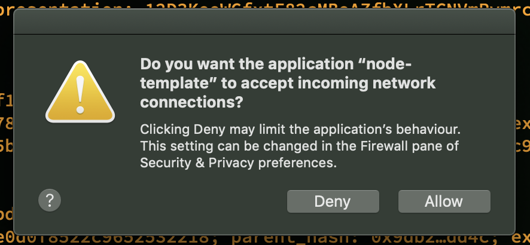
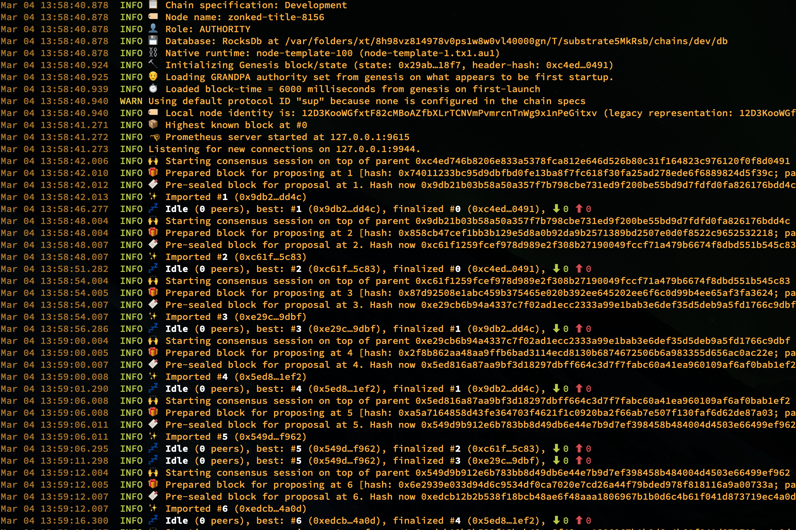
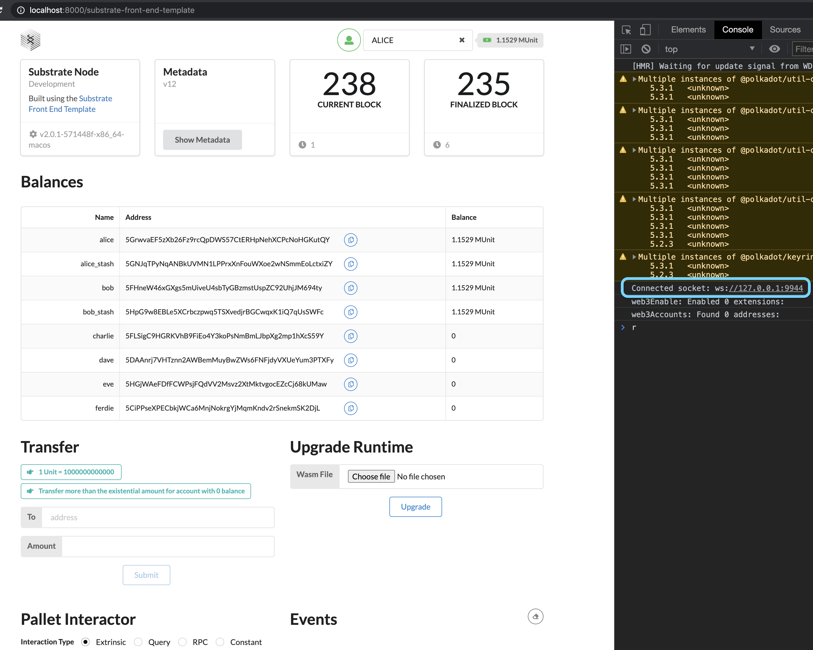

# Run your first `blockchain`

The purpose of this chapter is NOT to make you become a `blockchain` expert. It aims to let you have an overview of what
a `blockchain Node` looks like and feel it by interacting with it.

Now, it's the time to know more about the `Blockchain Node (Substrate Client)` before you run the real `blockchain` on
your computer. Let's take a look at the architecture again:


For the easy understanding purpose, let's separate the running applications into two categories below:

### Backend

The `Backend` means the `Blockchain Node` application that handle all the `blockchain`'s necessary functionalites:

- Save the entire `blockchain` blocks (data) locally.

    _It uses a simple key-value data store implemented as a `database-backed` to persist all the block data.
    That data store is a modified [Merkle tree](https://en.wikipedia.org/wiki/Merkle_tree) and based on
    [RocksDB](https://rocksdb.org/). That's the `STORAGE` component in the diagram._

    </br>

- Connects your local `Blockchain Node` to the `blockchain P2P network`.

    _It uses the `libp2p` network stack to allow your `Node` to communicate with other `Node` on the same `P2P` network.
    That's the `P2P NETWORKING` component in the diagram._

    </br>

- Allows all the `Nodes` to agree on the state of the `blockchain`. 

    _`Consensus engines` had already mentioned in the previous chapter. So `Substrate` makes it possible to supply custom 
    consensus engines and also ships with several consensus mechanisms that have been built on top of Web3 Foundation research.
    That's the `CONSENSUS` component in the digram._

    </br>

- Allows the third-party applications to interact with your `Node`

    _As the `Node` is an invisible application running in the background to maintain all the blocks, so how the `blockchain user` can
    interact with the data? For that purpose, `Substrate` provides the `RPC (remote procedure call)` implementation as the the HTTP and 
    WebSocket RPC servers. That's the `RPC` component in the digram._

    </br>

- Run your unique `blockchain` business logic

    _As each `blockchain` provides different and unique functionality, that means some sort of the logic code will be run inside the `Node`
    to process each block. For getting the best flexibility and performance, `Substrate` allows developer to implement the business logic
    by any programming langauge and compile as `WebAssembly (WASM)` format, and becomes part of the blockchain's storage state. This enables
    one of the defining features of a Substrate-based blockchain: **forkless runtime upgrades**._

    _That's the `Wasm Runtime` component in the diagram._

</br>
    
So let's download and run the `blockchain node` locally

```bash
git clone -b v2.0.1 --depth 1 https://github.com/substrate-developer-hub/substrate-node-template
cd substrate-node-template/

# Run the `init` script to initialize your WebAssembly build environment
make init
# ./scripts/init.sh
# *** Initializing WASM build environment ***
# info: syncing channel updates for 'nightly-x86_64-apple-darwin'
# 
#   nightly-x86_64-apple-darwin unchanged - rustc 1.52.0-nightly (35dbef235 2021-03-02)
# 
# info: checking for self-updates
# info: syncing channel updates for 'stable-x86_64-apple-darwin'
# 
#   stable-x86_64-apple-darwin unchanged - rustc 1.50.0 (cb75ad5db 2021-02-10)
# 
# info: checking for self-updates
# info: component 'rust-std' for target 'wasm32-unknown-unknown' is up to date


# Compile the release Node binary
make build
```

The compilation process does take time, it totally depends on your hardware. 

After done, Let's run that:

```bash
# Run a temporary node in development mode
./target/release/node-template --dev --tmp
```
If you're running in `MacOS` and you've already enabled the `Firewall` settings, it will ask for the network permission like below:



And you will see it will keep generating the block contiguously like below:



You can run the network command to print out all the related TCP port for the `Node` process like below:

```bash
lsof -nP -iTCP | grep node-temp

# node-temp 13710 wison   23u  IPv4 0x14f1cb2c9f2fbe81      0t0  TCP 127.0.0.1:9615 (LISTEN)
# node-temp 13710 wison   30u  IPv4 0x14f1cb2c96198191      0t0  TCP 127.0.0.1:9933 (LISTEN)
# node-temp 13710 wison   34u  IPv4 0x14f1cb2c9a9cd809      0t0  TCP 127.0.0.1:9933 (LISTEN)
# node-temp 13710 wison   38u  IPv4 0x14f1cb2c9a9ceb19      0t0  TCP 127.0.0.1:9933 (LISTEN)
# node-temp 13710 wison   42u  IPv4 0x14f1cb2c9a9cf4a1      0t0  TCP 127.0.0.1:9933 (LISTEN)
# node-temp 13710 wison   49u  IPv4 0x14f1cb2c9a86ee81      0t0  TCP 127.0.0.1:9944 (LISTEN)
# node-temp 13710 wison   54u  IPv4 0x14f1cb2c9a870191      0t0  TCP *:30333 (LISTEN)
# node-temp 13710 wison   55u  IPv6 0x14f1cb2ca81752f9      0t0  TCP *:30333 (LISTEN)

procs node-temp
#  PID:▲  User │ TTY  Threads                       TCP   VmRSS │ Command
#              │                                        [bytes] │
#  971   wison │ s002   45    [9615, 9933, 9944, 30333] 39.473M │ ./target/release/node-template --dev --tmp
```

</br>

### Frontend

Ok, you've already run the `Node` (as the `Backend`) in the background. For interacting with all those blocks data, you need a 
`Frontend` application to call the `RPC` (API) to interact with it. Let's do it:

```bash
# Clone the code from github
git clone -b v2.0.1 --depth 1 https://github.com/substrate-developer-hub/substrate-front-end-template

# Install the dependencies
cd substrate-front-end-template
yarn install

# Run it
yarn start
```

Then open `http://localhost:8000/` in your browser, that's the webapp you use to interact with the `Node`.



Plz pay attention to the right-side of the screenshot, inside the browser console, you can see that the WebApp actually connects to 
the `Node's RPC` server via `WebSocket`. That's why the WebApp can keep refreshing the latest block data and render it into the UI.

</br>

### Summary

It looks a lot of new stuff in this chapter, it summarizes just a few things below:

- You need to run a `Blockchain Node` application locally and connect your `Node` to the same `Blockchain P2P network`.

- You need a separated `Frontend` web application or `Desktop` application to interact with your local Node. That's how you as an user
to deal with the particular `Blockchain`.

</br>

