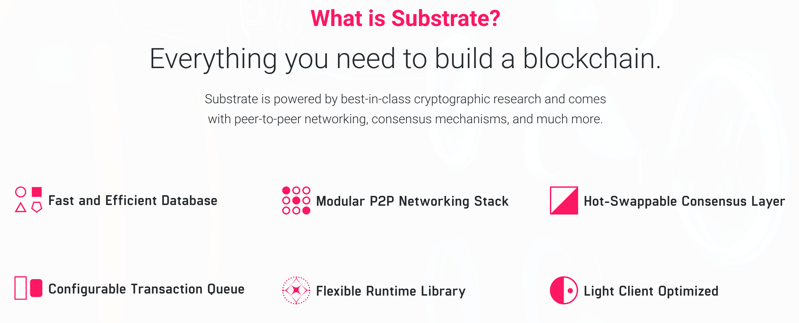

# What is `Substrate`

`Substrate` is a flexible framework for building modular, efficient, and upgradeable `blockchains`. 

`Substrate` is written in the `Rust` programming language and is maintained by **Parity Technologies**.

This screenshot is the best way to describe what is `Substrate`:

If you think about that a `Blockchain` works like a `State Machine` which means
it keep creating the `New State` from the `Previous State` and generate the `Next Block` 
and then attach to the `Blockchain`.

`substrate` architecture

`Runtime`: WASM format, it's all about the `blockchain` application logic which like
writing a `State Transition Function`.

